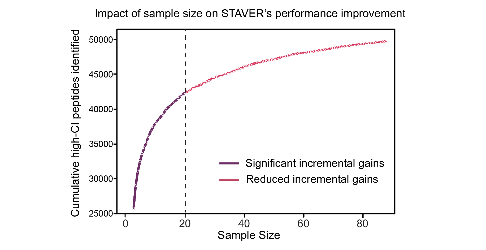

# Tutorials

The `STAVER` algorithm aims to reduce non-biological noise and variation in large-scale DIA proteomic datasets, thereby enhancing the precision and reliability of peptide identification and protein quantification. STAVER, featuring a modular design **(Figure 1)**, provides flexible compatibility with existing DIA-MS data analysis pipelines, such as DIA-NN, Spectronaut, etc. The operational sequence of STAVER and the functions of each module are delineated as follows. Here, we provide a brief overview of each stage and link to the corresponding tutorial. 

The `STAVER` workflow is implemented in the `staver_pipeline` module. This module provides a comprehensive proteomics data analysis tool designed to streamline the workflow from raw data preprocessing to the final result output. The STAVER workflow consists of several steps: (1) Data ingestion; (2) Preprocessing of DIA-MS proteomics profile data; (3) Identification of high-confidence peptides using a standard benchmark dataset; (4) Protein quantitative inference based on the identified high-confidence peptides; and (5) Generation of output results and visualization. We implemented the STAVER workflow in Python, designing it for operation both in the terminal environment via the Command-Line Interface (CLI) and compatible with the Jupyter Notebook environment.

In this document, we present a detailed tutorial for executing the `STAVER workflow` on DIA-MS datasets through multiple methodologies. These include utilizing the `Command-Line Interface (CLI)` and invoking the function with either `List Parameters` or `Dict Parameters`. The tutorial is meticulously structured as a step-by-step guide, enabling users to proficiently apply the STAVER workflow to their own specific DIA-MS datasets. The tutorial is divided into the following sections:


**Figure 1. The framework of the STAVER algorithm.** The architecture of the STAVER algorithm mainly consists of four modules: (I) the input/output module, (II) the data preprocessing module, (III) the high-confidence peptide identification (High-CI-Peptides) module, and (IV) the protein quantification (Peptide-to-Protein inference) module. 

## Stage 1: Data Input/Output (I/O)
In the realm of proteomics software development, ensuring seamless data management is paramount. At the forefront of this process lies the Input/Output (I/O) module. This module serves as the gateway for data flow within the system. Its primary responsibilities include: (1) ingesting data, (2) archiving intermediate outcomes, and (3) storing finalized processed results.

### Data Ingestion
In the STAVER workflow's initial step, two distinct datasets are required: a standard reference dataset and a DIA-MS dataset from the study cohort that requires calibrations. The DIA-MS dataset from the study cohort is essential, whereas the standard reference dataset remains optional. Importantly, when a standard reference dataset is not supplied or unavailable, the STAVER defaults to employing its built-in standard benchmark dataset for correction purposes. Notably, STAVER is planning to expand its database to encompass a more comprehensive range of built-in standard reference benchmark datasets, thus providing users with an enriched selection. To achieve optimal performance in STAVER, it is highly recommended to use a standard reference dataset that is specifically tailored to the specific mass spectrometry platform or laboratory employed. Ideally, this dataset should consist of a sample that is consistent with or closely related to the study cohort. The data ingestion process was performed using the STAVER function with the following parameters: ‘--input <DIA data input directory>’ and ‘--reference_dataset_path <DIA standard reference directory>’. Where the --input parameter is required, while the ‘--reference_dataset_path’' parameter is optional. This function employs the `joblib_load_file` function for efficient parallel loading of proteomic datasets, utilizing all available CPU cores (`CPU cores - 2`) by default. Flexibility is offered to users through the optional `-thread_numbers CPU_numbers` parameter, enabling customization of the core allocation.


#### Input Dataset Data Format Requirements
The Input/Output (I/O) module in STAVER adeptly handles a variety of proteomic data types, accommodating multiple formats and sources. Specifically, STAVER is compatible with prevalent file formats used to archive outputs from various library search tools in upstream DIA-MS data analysis. These include `.csv`, `.tsv`, `.txt`, `.xls`, `.xlsx`, `.xlsm`, `.mzTab`, `.mzIdentML (.mzid)`, `.pepXML`, and `.protXML`. Datasets in other formats must be converted into one of these supported formats prior to import. For enhanced processing efficiency, it's highly recommend to using binary formats like tab- or comma-delimited files, such as `.tsv`, `.txt`, or `.csv`. This process is implemented mainly through the defined `read_proteomics_file` function.

```python
import os
import pandas as pd
from pyteomics import mzid, pepxml, protxml, mztab

from staver.data import joblib_load_file

def read_proteomics_file(file_path):
    """
    Reads various proteomics output file formats and returns the content.

    This function reads data from different proteomics file formats and returns
    it as a pandas DataFrame. It supports common file formats like CSV, TSV, Excel,
    and specialized formats like mzid, pepxml, protxml, and mztab.

    Parameters:
        file_path (str): Path to the proteomics file.

    Returns:
        pd.DataFrame: DataFrame containing the data from the file.

    Raises:
        ValueError: If the file does not exist or if the file extension is unsupported.
    """
    if not os.path.exists(file_path):
        raise ValueError(f"File {file_path} does not exist!")

    ext = os.path.splitext(file_path)[1].lower()

    # Reading common file formats
    if ext in ['.txt', '.tsv', '.csv']:
        delimiter = '\t' if ext == '.tsv' else ','
        return pd.read_csv(file_path, delimiter=delimiter)

    elif ext in ['.xls', '.xlsx', '.xlsm']:
        return pd.read_excel(file_path)

    # Reading specialized proteomics file formats
    try:
        if ext == '.mzid':
            return pd.DataFrame(mzid.read(file_path))

        elif ext == '.pepxml':
            return pd.DataFrame(pepxml.read(file_path))

        elif ext == '.protxml':
            return pd.DataFrame(protxml.read(file_path))

        elif ext == '.mztab':
            with mztab.MzTab(file_path) as reader:
                psm_data = reader.spectrum_match_table
                return pd.DataFrame(psm_data)

    except Exception as e:
        raise ValueError(f"Error reading {ext} file at {file_path}: {str(e)}")

    raise ValueError(f"Unsupported file extension: {ext}")
```

**Example usage**
- Read single proteomic file
```python
from staver.data import read_proteomics_file

result = read_proteomics_file('path_to_file.txt')
print(result)
```
- Read multiple proteomic files
For large-scale DIA research cohorts (hundreds or thousands of DIA datasets), the `joblib_load_file` function to efficiently load proteomic datasets in parallel, with default to all available CPU cores `(CPU cores - 2)`. Users can enhance flexibility by adjusting the default allocation using the `-thread_numbers CPU_numbers` parameter.

```python
from staver.data import joblib_load_file

result = joblib_load_file(inpath="/path/to/files", extension=".txt")
print(result.head())
```

#### Minimum Sample Size for Guaranteed STAVER Performance
To evaluate the impact of sample size of the standard reference dataset on the STAVER algorithm’s performance, we have conducted a series of ablation studies focusing on sample size to ascertain the minimum number of datasets required for optimal performance of the STAVER algorithm **(Figure 2)**. This analysis demonstrated the impact of sample size on the performance improvement of high-confidence peptide identification within the STAVER framework. These results revealed that increasing the sample size to 20 significantly improves STAVER's performance. Beyond this threshold (20 samples), we observed that the incremental gains in STAVER's performance from additional samples began to diminish. Consequently, we strongly recommend conducting no fewer than `20` DIA-MS runs when utilizing the STAVER algorithm to ensure optimal outcomes.


**Figure 2**. **Evaluating the STAVER Algorithm Performance through Sample Size Ablation Experiments.** (A) The line plot depicts the relationship between sample size and the number of high-confidence peptides identified by the STAVER algorithm with default STAVER parameters set, illustrating the performance improvement of STAVAR analysis with an increase in sample size. The vertical dashed line at the 20-sample point delineates the two phases, indicating the threshold at which the rate of incremental gains begins to diminish. The purple and red dots represent significant incremental gains and reduced gains, respectively. 

### Intermediate Data Management
During the processing of proteomic datasets, the software generates a range of intermediate results. These span from transient datasets needed for specific computational operations to significant benchmarks within the processing sequence. The Input/Output (I/O) module systematically archives these results, facilitating potential future examination or further analytical work.

### Archiving and Storage of Final Processed Results
Upon the completion of data processing, the software systematically archives the final processed results. The I/O module ensures the secure storage of these results and arranges them for straightforward retrieval and subsequent analysis. The default output location for these outcomes is the directory where the program is currently executed, users are provided the flexibility to designate an alternative output path.

**Example usage**

```python
from staver import staver_pipeline

# construct the parameter list
args = [
    "--thread_numbers", "8",
    "--input", "path_to_input",
    "--output_peptide", "path_to_output_peptide",
    "--output_protein", "path_to_output_protein",
    # Other required parameters
]

# construct parameters in dictionary format
args = {
    "thread_numbers": 8,
    "input": "path_to_input",
    "output_peptide": "path_to_output_peptide",
    "output_protein": "path_to_output_protein",
    # Other required parameters
}

# running function
staver_pipeline(args)
```

## Stage 2: Preprocessing of DIA-MS proteomics profile data
The data preprocessing module plays a pivotal role in harmonizing disparate data formats, originating from diverse DIA (Data-Independent Acquisition) search algorithms, into a unified and standardized representation. This consolidation ensures that data from varying sources is not only compatible but also primed for subsequent analyses with enhanced accuracy.

### Harmonizing Output Data Structure and Format:

Different DIA search algorithms can produce outputs with diverse schemas, possibly using various naming conventions and data structures. Such disparities can impede consistent data analysis. The data preprocessing module addresses this by:

**Standardizing Terminology Conventions and Data Structure**: Given the myriad of tools and platforms in proteomics, different terminologies might refer to the same entity across datasets. To address this, we perform the harmonization of the output data structure, which involves the adoption of a uniform standardization convention for proteins, peptides, and other entities. This approach ensures the seamless integration of DIA-MS data from various sources. To be more specific, the standard terminologies convention adopts the DIA-NN output as a benchmark. Data outputs from alternative library search tools and algorithms are systematically reformatted to align with DIA-NN's standardized format, thereby ensuring consistency and uniformity in both terminology and data structure. This preprocessing step ensures the compatibility of STAVER and promotes consistency in downstream analyses regardless of the initial software or workflow chosen.

**Achieving a Unified Long-Format Dataframe**: Following the harmonization of uniform terminologies conventions, the DIA-MS proteomics profile data need to be prepared in Long-Format Data, a streamlined structure ideal for downstream analyses. To ensure the input data was valid for downstream analyses, the default STAVER workflow removes entries with null values for both gene and peptide abundance during initial preprocessing. In the subsequent data preprocessing phase, the DIA-MS profile data are concatenated into a single DataFrame in the long format using the 'pandas.concat(axis=0)' function. This cohesive structure simplifies data manipulation and ensures uniformity, thereby streamlining later analytical processes. 

**Example usage**

```python
from staver.preprocessing import harmonize_columns

# running function
# The dataframes, df_DIANN, df_spectronaut and df_openswath from the respective software.
df_diann_standardized = harmonize_columns(df_DIANN, 'DIA-NN')
df_spectronaut_standardized = harmonize_columns(df_spectronaut, 'Spectronaut')
df_openswath_standardized = harmonize_columns(df_openswath, 'OpenSWATH')
```

### False Discovery Rate (FDR) Assessment:

To maintain rigorous control over potential false positives and ensure the high reliability of peptide identifications, we employ a two-dimensional, dual-threshold filtering approach. This strategy combines peptide-level and protein-level False Discovery Rate (FDR) thresholds for robust filtering. The FDRs of peptide and protein were initially estimated by the corresponding search software used in the upstream analysis. Subsequently, strict pre-filtering was applied based on two criteria: a peptide-level Q-value of less than 1% per experiment and a global protein-level Q-value of less than 1%. This established filtering protocol aligns with best practices employed in prior research (*Nature Methods*., 2019, PMID: 31768060; *Molecular & Cellular Proteomics*, 2015; PMID: 25724911; *Cancer Cell*, 2022, PMID: 35839778).

Employing this dual-threshold criterion is instrumental in exerting initial control over the confidence level of the identified peptides, thereby enhancing the reliability and robustness of the proteomic analysis.

### Constructing Union Index for Enhanced Data Retrieval and Analysis:

To facilitate efficient data retrieval and analysis within a multi-dimensional proteomics dataset, a multi-level index construction was implemented, encapsulating key elements such as experimental samples, generated spectral library's coordinates of the raw file, protein groups, and peptide information. In the context of data transformation within a long-form DataFrame, the `index_transform` function is designed to either concatenate multiple columns into a unified index or to disaggregate a constructed existing index into individual columns, depending on the setting of the `convert_reverse` parameter.

When `convert_reverse` is set to False, the function performs a concatenation of specified columns to create a unique peptide index. This newly created index serves as a comprehensive identifier, encapsulating the critical information of each experimental unit into a cohesive format. Specifically, this step involves constructing a unified index by concatenating four distinct features: $S$ (representing Experimental Samples, denoted by File.Name), $L$ (Spectral Library's Raw file Coordinates, denoted by Library.Coordinate), $P$ (representing Protein Groups), and $Pr$ (Precursors, denoted by Precursor.Id), using an underscore ("_") as the delimiter.
$$
\text{CompositeIndex}_{(i, j, k, l)} = \{ \text { Concatenate }(p \text {, sep }=\text { "\_") } \mid p \in (S_i, L_j, P_k, Pr_l)\}
$$

Where:

- $sep$ denotes the concatenation operation using an underscore “_” separator.
- $\text{CompositeIndex}_{(i, j, k, l)}$ is the unique identifier for each data point.
- $S_i$ represents the $i^{th}$ Experimental Sample, denoted by File.Name.
- $L_j$ represents the $j^{th}$ raw file coordinate of the Spectral Library, denoted by Library.Coordinate.
- $P_k$ represents the $k^{th}$ Protein Group, denoted by Protein.Groups.
- $Pr_l$ represents the $l^{th}$ Precursor, denoted by Precursor.Id.

**Enhances Data Retrieval:** By utilizing identifiers as primary keys, data retrieval operations become significantly more efficient, ensuring prompt responses even with voluminous datasets.

**Facilitates Data Operations:** With a systematic index in place, various data operations, including searches, updates, and manipulations, become streamlined, reducing computational overheads.

**Example usage**

```python
from staver.preprocessing import construct_index

# running function
# The standardized dataframes, df_diann_standardized, df_spectronaut_standardized and df_openswath_standardized from the respective software.
df_diann_indexed = construct_index(df_diann_standardized)
df_spectronaut_indexed = construct_index(df_spectronaut_standardized)
df_openswath_indexed = construct_index(df_openswath_standardized)
```

### Infrastructure Recommendations:

Proteomics datasets, especially after comprehensive preprocessing, can be colossal. To handle the complexity and volume, we need to optimize the memory occupied by the data in a timely manner. The data preprocessing module addresses this by:

**Optimizing Memory Usage:** This module minimizes memory consumption, ensuring that even large datasets are processed efficiently, without causing processing bottlenecks, thus enabling seamless and continuous operations.

**Robust Computational Infrastructure:** We recommend a relatively robust infrastructure, ideally equipped with a minimum of 32 GB of operational memory. Such capacity is essential to process substantial datasets efficiently, ensuring uninterrupted and fluid processing

**Scalability Considerations:** Given the ever-evolving nature of proteomics data, it's prudent to opt for a system that allows for easy scalability. This ensures that as datasets grow, the infrastructure can be augmented without significant overhauls.

**Example usage**

```python
from staver.preprocessing import reduce_mem_usage

def memory_usage_info(verbose, start_mem, end_mem):
    """Print the memory usage information."""
    if verbose:
        print(
            f"Memory usage decreased from {start_mem:.2f} MB to {end_mem:.2f} MB "
            f"({100 * (start_mem - end_mem) / start_mem:.1f}% reduction)"
        )

original_memory = df.memory_usage().sum() / 1024**2
df_reduced = reduce_mem_usage(df)
reduced_memory = df_reduced.memory_usage().sum() / 1024**2

memory_usage_info(verbose=True, start_mem=original_memory, end_mem=reduced_memory)
```

## Stage 3: High-confidence Peptide Identification 
To ensure the authenticity and reliability of identified peptides, this module is meticulously designed to sift through peptide matrices, setting apart genuine peptides from potential artifacts. These artifacts often arise from non-biological interferenc and noise, which can significantly obfuscate downstream proteomic analyses. 

During peptide identification, the high-confidence peptide module conducts a comprehensive analysis on a set of 'n' peptide matrices from a standardized benchmark dataset, each derived from technical replicate samples for continuous injection searched against the hybrid spectral library. Integrating prior knowledge from the benchmark dataset significantly enhances the analytical capability. The module carefully differentiates high-confidence peptides from potential artifacts, primarily introduced by nonbiological noise. The core of the high-confidence peptide module is the peptide scores calculation step. Comprehensive peptide confidence assessment employs a strategy that synergistically combines peptide frequency, fragment intensities, peptide retention times (RT), and variation metrics across samples. First, the prior data from the benchmark dataset are loaded. Peptides with the same sequence but different PTMs and/or charges are treated as different peptides. This list is then passed through the peptide confidence scoring system to yield the peptide confidence scores and ranks. Each peptide is assigned a normalized metric score ranging from 0 to 1, with scores closer to 1 signify an elevated degree of confidence in the peptide's authenticity.

The high-confidence peptide identification module of STAVER operates on a long-format matrix, $\mathbf{X} \in \mathbb{R}^{N \times \mathbf{M}}$, derived from preprocessing and aggregating spectral library search results from $N$ samples. Matrix $\mathbf{M} \in \mathbb{R}^{P \times L}$ serves as a comprehensive record of peptide identifications and characteristics, such as retention times and fragment ion intensities. The structure of $\mathbf{X} \in \mathbb{R}^{N \times \mathbf{M}}$ reflects the integration of this peptide information across $N$ DIA samples of the standard benchmark dataset, enabling STAVER to perform robust analysis considering sample variability and peptide detection consistency. The process of identifying high-confidence peptides involves five primary steps:

(I) Pre-filtering peptide to exclude background noise, typical peptides with extremely low intensity;
(II) Normalization of all observed peptide intensities and conducting quality control;
(III) Extracting critical features of peptides;
(IV) Constructing the peptide confidence scoring system and introducing penalty mechanisms;
(V) Identify high-confidence peptides using the scoring system.


### (I) Pre-filtering Peptides to Exclude Background Noise:

The first step of the high-confidence peptide identification module is to pre-filter peptides to exclude background noise, typical peptides with extremely low intensity and low detection frequency. The initial step involves the pre-filtering of peptides to eliminate background interference, which particularly targets peptides quantified with extremely low intensity to enhance data reliability. This involves eliminating peptides that are more likely to be background noise rather than authentic signals. Background noise that might arise from various sources, such as environmental contaminants, nonspecific binding, or instrumental artifacts. The exclusion criteria typically include:

**1. Low Detection Frequency**: Peptides infrequently detected across multiple samples or runs are often considered background noise. Peptides with extremely low detectability can lead to high-sparsity data, potentially hindering subsequent analytical processes. To mitigate this, a common approach is to establish a minimum detection threshold. In our study, the default threshold was set to 2, requiring the detection of a peptide in at least two samples within the standard benchmark dataset to be considered in the analysis (*Molecular & Cellular Proteomics*, 2014; PMID: 24942700). This threshold can be adjusted according to the corresponding requirements of different studies.
**2. Low-Intensity peptides**: Peptides that exhibit very low-intensity signals, which are nearly indistinguishable from background noise, are excluded from the analysis (*Molecular & Cellular Proteomics*, 2019; PMID: 31235637). This exclusion is typically informed by the distribution of signal intensities across the dataset. For example, peptides with intensities that asymptotically approach zero are generally omitted from consideration **(Figure 3A)**.

### (II) Normalization of all observed peptide intensities and conducting quality control

Normalization is an essential step in proteomic data preprocessing, addressing systematic technical variations encountered during sample preparation, peptide ionization, and mass spectrometry (MS) analysis stages. In this step, `median normalization` and `log-transform` of observed peptide intensities are employed in the DIA quantitative profiles of the standard reference dataset, aiming to stabilize variance across intensity values and correct potential systematic biases. Subsequently, `quality control` measures were rigorously applied to the samples of the standard reference dataset to guarantee that subsequent analyses were founded on high-quality and reliable data.

**Log Transformation**
The first stage involves the application of a logarithmic transformation to the peptide intensity values, reducing distribution skewness, stabilizing variance across different intensity levels, and facilitating the use of parametric statistical methods predicated on data normality (*Molecular & Cellular Proteomics*, 2010; PMID: 20382981; *Brief Bioinform*, 2020, PMID: 30649171). This transformation is beneficial for several reasons: (1) It reduces the skewness of the distribution of intensity values, which is typically right-skewed due to the presence of a few highly abundant peptides **(Figure 3A)**. (2) It stabilizes the variance across peptides with different intensity levels, as the variance in raw intensity data is often proportional to the mean intensity. (3) It allows for the use of parametric statistical methods that assume the normality of the data.


**Figure 3.** (A) The distribution of peptide intensities across all samples. The left panel depicts the raw quantification intensity, while the right panel shows the intensity after log transformation.

**Median Normalization**
Following log transformation, the next step is to perform a median normalization to adjust for disparities in peptide abundance between samples, which might result from variations in sample preparation, loading, or instrument sensitivity (*Brief Bioinform*., 2018, PMID: 27694351; *Nature Protocols*, 2021, PMID: 34244696; *Nature Communications*,2020, PMID: 32732981). This step ensures a uniform median intensity value across all peptides for each sample, providing a standardized reference point.

**Quality control for the standard reference datasets**
Stringent quality control is imperative in establishing standard reference datasets from technically replicated samples. In this study, to ensure data integrity and comparability of samples within a constructed standard reference dataset, we employ ‘PyOD’ package (version 1.1.2, https://github.com/yzhao062/pyod) to perform quality control (QC) on the provided standard reference datasets. PyOD provides a variety of anomaly detection algorithms, such as Isolation Forest, One-Class Support Vector Machine (OCSVM), and Local Outlier Factor (LOF), which are instrumental in detecting and isolating outliers. These methods enable the systematic identification of samples that deviate significantly from the expected variation patterns, which is crucial for maintaining the reliability and integrity of downstream analyses. Confirmed outliers are rigorously excluded, thereby preserving dataset quality and validity.

To visually validate and evaluate the findings of "PyOD", we provide a visualization for quality control. PCA offers a two-dimensional (2-D) projection of the data ($\mathrm{PCA:\ }R^n\rightarrow R^2$), allowing for an intuitive visual assessment of sample quality. Additionally, the abundance density plots and boxplots for peptides provide a detailed view of distribution patterns within each sample **(Figure 4A-3B)**, assisting in identifying potential anomalies in the data. If the density plots showed a clear bimodal distribution or a significant offset from the distribution of other samples, indicating that the sample exhibited poor quality and should be excluded from downstream analysis. 


**Figure 4**. **Quality control for the standard reference datasets.** (A) The boxplot depicts the log2-transformed intensity values for peptide quantification across samples, following median normalization. Each box delineates the interquartile range of intensities for a sample, with the central line marking the median. Outliers are represented as individual points. (B) The density plot illustrates the distribution of log2-transformed precursor intensities. This visualization provides an understanding of the data's probability density along with the actual data points along the x-axis.

### (III) Extracting critical features of peptides

In the context of the identification of high-confidence peptides, the extraction of critical features of peptides is a fundamental step for constructing robust peptide scoring systems. This step involves a thorough analysis of pivotal peptide characteristics that reflect their identification confidence and quantitative precision. Features typically assessed encompass the coefficient of variation (CV), identification frequency, abundance, and retention time (RT) consistency of the peptide. These characteristics are subsequently utilized to construct a scoring system that could distinguish between high-confidence peptides and those that are less reliable.

### (IV) Constructing a robust peptide confidence scoring system based on the peptide features

Upon extracting peptide features, our objective is to amalgamate information from these critical features—namely, the coefficient of variation (CV), identification frequency, abundance ranking, and retention time (RT) consistency—to develop a comprehensive peptide confidence scoring system. This system is designed to assess and characterize the quality and reliability of peptide identification and quantification.

In the context of constructing standard reference datasets for STAVER, which are based on technical replicates of a consistent composition sample and concentrations, all peptide features such as distribution, abundance, identification frequency, and RT should theoretically be identical, showing no deviation. Nevertheless, in practice, factors like batch variations, changes in the mobile phase, reduced mass spectrometry sensitivity, alterations in peptide ionization efficiency, and even environmental fluctuations can lead to slight inconsistencies in detection results. Thus, minor and acceptable shifts in identified peptide abundance and RT may occur due to these systematic biases. Notably, significant variations or biases in peptide abundance quantification or RT, likely indicative of noise or variability, can greatly compromise identification reliability.

Considering these characteristics, we have devised an integrated scoring system, refined with penalty mechanisms and reward measures to enhance its robustness and accuracy. An empirically defined threshold for peptide variation and RT bias has been established. Within this threshold, no penalty affects the confidence score; exceeding it incurs a penalty based on a non-linear function (exponential function). The further a peptide's CV or RT deviation strays from the threshold, the lower its confidence score, gradually nearing zero. We also introduce a correction factor for peptide distribution. Moreover, a function based on a reward mechanism considers the impact of peptide abundance and identification frequency on the final confidence score. Higher identification frequencies or peptide abundances positively influence and reinforce the comprehensive confidence score.

### (V) Identify high-confidence peptides using the scoring system
Finally, based on the constructed peptide scoring system, each identified peptide from the standard reference dataset is assigned a normalized score ranging from 0 to 1, with scores closer to 1 signify a higher degree of confidence in the peptide's authenticity and reliability. Subsequently, the process of peptide confidence assessment involves the establishment of scoring criteria and the categorization of peptides into distinct confidence levels based on their scores. This process can be divided into the following steps: (i) establishing thresholds for confidence levels, (ii) categorizing peptides according to scores and validating results, and (iii) prioritizing high-confidence peptides for inclusion in the refined spectral library.


### Usage

The `HighCIPeptides` class is designed to facilitate the high-confidence peptide identification process. Users can leverage this class by instantiating it and invoking the `main()` method. This method orchestrates the entire workflow for identifying high-confidence peptides and outputs the path to the refined file, which contains the precursor ions with high confidence scores.

To tailor the `HighCIPeptides` class functionality to specific needs, users may adjust the default attributes or provide alternative values as parameters during instantiation.

The following example demonstrates how to employ `the HighCIPeptides` module in practice. Begin by importing the class and then execute the `main()` method:

**Example usage:**

```python
from staver.HighCIPeptides import HighCIPeptides

# Initialize the class
staver = HighCIPeptides()
staver.main()
```

## Stage 4: Protein quantitative inference 

In the realm of proteomics, accurate protein quantification and peptide-to-protein inference stand as cardinal processes, paving the way for the in-depth exploration of cellular systems and biological processes. The `PeptideToProteinInference` module is designed to infer proteins from high-confidence peptides. Which employs the MaxLFQ algorithm, renowned for its precision and robustness ([Cox et al., 2014; *Mol Cell Proteomics*](https://www.mcponline.org/article/S1535-9476(20)33310-7/fulltext)), to estimate relative protein abundances from ion quantification in DIA-MS-based proteomics. Notably, we present an open-source implementation of the widely-used maximal peptide ratio extraction algorithm of the MaxLFQ algorithm in Python, previously only compatible with data-dependent acquisition mode in the closed-source MaxQuant software package. 

In the final step, STAVER's protein quantification workflow can be delineated into three stages: (i) Data preprocessing, (ii) Extraction of maximum peptide ratio information, and (iii) The estimated protein abundance profiles are systematically arranged in two-dimensional (2-D) tables, with columns representing samples and rows indicating identified protein groups.

The custom-defined `MaxLFQ` function for protein quantification in the DIA data processing pipeline was integrated into the `PeptideToProteinInference` module. The following elucidates the process of implementing the Protein Quantification (Peptide-to-Protein Inference) Module.

### Implementation of the MaxLFQ Algorithm in Python
This following code defines the `maxLFQ` function that calculates the maximum likelihood fold change estimates for each column of the input DataFrame `X`. The function returns a dictionary with the keys `'estimate'` and `'annotation'`.

```python
class MaxLFQOptimizer:
    """
    A class for optimizing the maxLFQ algorithm using Numba for faster computation.

    This class contains methods for performing the maxLFQ quantification algorithm on mass spectrometry data.
    It is optimized with Numba to improve performance.

    Methods:
        _spread(i, g, cc, X): Assigns group labels to elements in a matrix.
        _maxLFQ_do(X_sub): Performs the maxLFQ algorithm on a subset of the data.
        maxLFQ_fast(X): Applies the maxLFQ algorithm to the given data matrix.

    Usage:
        >>> optimizer = MaxLFQOptimizer()
        >>> data = np.array([[np.nan, 1, 2], [np.nan, np.nan, 2], [3, 4, np.nan]])
        >>> result = optimizer.maxLFQ_fast(data)
        >>> print(result)

    Note:
        This is an optimized version of the algorithm, designed for large-scale computations.
    """

    def __init__(self):
        """ Initializes the MaxLFQOptimizer class. """
        pass

    @staticmethod
    @numba.jit
    def _spread(i, g, cc, X):
        """
        Recursively assigns group labels to elements in a matrix.

        Args:
            i (int): The current column index in the matrix.
            g (np.ndarray): An array to store group labels.
            cc (int): The current group label.
            X (np.ndarray): The input data matrix.

        This method is part of the maxLFQ algorithm and is optimized with Numba.
        It assigns group labels to elements in X, based on their non-NaN status and connectivity.
        """
        g[i] = cc
        for r in range(X.shape[0]):
            if not np.isnan(X[r, i]):
                for k in range(X.shape[1]):
                    if not np.isnan(X[r, k]) and np.isnan(g[k]):
                        MaxLFQOptimizer._spread(k, g, cc, X)

    @staticmethod
    @numba.jit
    def _maxLFQ_do(X_sub):
        """
        Performs the maxLFQ algorithm on a subset of the data.

        Args:
            X_sub (np.ndarray): A subset of the original data matrix.

        Returns:
            np.ndarray: The results of the maxLFQ algorithm on X_sub.

        This method implements the maxLFQ algorithm, optimized with Numba. It calculates the relative
        quantities of peptides/proteins from the input LC-MS/MS data.
        """
        N = X_sub.shape[1]
        AtA = np.zeros((N, N))
        Atb = np.zeros(N)

        for i in range(N - 1):
            for j in range(i + 1, N):
                r_i_j = np.nanmedian(X_sub[:, j] - X_sub[:, i])
                if not np.isnan(r_i_j):
                    AtA[i, j] = AtA[j, i] = -1
                    AtA[i, i] += 1
                    AtA[j, j] += 1
                    Atb[i] -= r_i_j
                    Atb[j] += r_i_j

        A = np.vstack([np.hstack([2 * AtA, np.ones((N, 1))]),
                        np.hstack([np.ones(N), 0])])
        b = np.append(2 * Atb, np.nanmean(X_sub) * N)

        res = lstsq(A, b, lapack_driver='gelsy')[0]

        return res[:N]

    def maxLFQ_fast(self, X):
        """
        Applies the maxLFQ algorithm to the given data matrix.

        Args:
            X (np.ndarray): A data matrix where rows represent samples and columns represent features.

        Returns:
            dict: A dictionary with two keys: 'estimate' containing the quantification result, and
                  'annotation' containing information about the calculation or errors.

        This method checks for empty or NaN-only data, handles single-row data, assigns group labels,
        and applies the maxLFQ algorithm to each group of features.
        """
        if X.size == 0:
            return {"estimate": np.nan, "annotation": "Empty array"}
        if np.isnan(X).all():
            return {"estimate": np.nan, "annotation": "All NaN values"}

        # Handle single row case
        if X.shape[0] == 1:
            return {"estimate": X[0], "annotation": [""]}

        N = X.shape[1]

        # Call accelerated function with numba
        cc = 0
        g = np.full(N, np.nan)
        for i in range(N):
            if np.isnan(g[i]):
                cc += 1
                self._spread(i, g, cc, X)

        w = np.full(N, np.nan)
        for i in range(1, cc + 1):
            ind = np.where(g == i)[0]
            if len(ind) == 1:
                w[ind[0]] = np.nanmedian(X[:, ind[0]])
            else:
                X_sub = X[:, ind]
                results = self._maxLFQ_do(X_sub)
                w[ind] = results

        # Check for all NaN results
        if np.isnan(w).all():
            return {"estimate": w, "annotation": "NA"}
        
        # Preparing final results
        annotation = ";".join(map(str, g)) if np.any(np.isnan(w)) else ""
        return {"estimate": w, "annotation": annotation}
```

The function first checks if all values in the DataFrame are NaN. If so, it returns a dictionary with NaN as the `'estimate'` value and the string "NA" as the `'annotation'` value.

If the DataFrame contains non-NaN values, the function proceeds to calculate the maximum likelihood fold change estimates. It does this by iterating over the columns of the DataFrame and assigning group labels to non-NaN values using a recursive `_spread` function. The function then calculates the estimates using the `_maxLFQ_do` function, which performs matrix operations and solves a linear least squares problem.

The resulting estimates are stored in an array `w`. If all values in `w` are NaN, the function returns a dictionary with `w` as the `'estimate'` value and the string "NA" as the `'annotation'` value.

If `w` contains non-NaN values, the function checks if all samples within each group have the same label. If they do, it returns a dictionary with `w` as the `'estimate'` value and an empty string as the `'annotation'` value.

If the samples within each group have different labels, the function updates the labels to NaN for the samples with NaN estimates, and returns a dictionary with `w` as the `'estimate'` value and a string representation of the updated labels joined by ';' as the `'annotation'` value.

### Usage
To enhance the `MaxLFQ` algorithm's performance in processing large-scale proteomics data, we have optimized its computational efficiency. Furthermore, we evaluated and compared its performance across datasets of varying sample sizes. For more details, please refer to the [benchmark_notebook](https://github.com/Ran485/STAVER/blob/main/staver/notebooks/MaxLFQ_benchmark.ipynb).

**Example usage:**
```python
from staver.PeptideToProteinInference import MaxLFQOptimizer
from staver.utils import generate_test_peptide_data

# Initialize a sample DataFrame with peptide intensities
peptide_intensities = generate_test_peptide_data(10, 200, 0.2) 

# Instantiate the MaxLFQOptimizer and apply the MaxLFQ method
optimizer = MaxLFQOptimizer()
result = optimizer.maxLFQ_fast(peptide_intensities.to_numpy())   

# Output the results
print(result)
```


## Workflow: STAVER pipeline module
The `STAVER` algorithm, is implemented and encapsulated in the `staver_pipeline` module, offers a comprehensive tool for proteomics data analysis. It streamlines the entire process from raw data preprocessing to final result generation. As a command-line based module, it enables efficient processing of large-scale DIA MS data using the standardized `STAVER` algorithm, primarily aimed at `variation reduction`. The module's key features include:

- **High Flexibility:** It supports multiple input file formats and allows users to adjust various parameters to suit their specific analysis requirements.
- **Scalability:** The module can process hundreds or thousands of DIA datasets simultaneously.
- **Extensibility:** Users can easily enhance the module with new features and functionalities.
- **Compatibility:** STAVER's modular design ensures it integrates well with existing DIA-MS data analysis pipelines.

### Utilizing the STAVER_pipeline

To effectively employ the `staver_pipeline` workflow, users can specify certain parameters through the `command line interface`, and invoking the function with either `List Parameters` or `Dict Parameters`. These essential parameters encompass thread numbers, paths for input data, and destinations for peptide and protein output data. Additionally, one may include optional parameters, such as the path for a reference dataset and thresholds for count cutoffs. The module features a `ValidateParser` class, designed to ensure the appropriateness of supplied paths and values, confirming they fall within anticipated ranges. Furthermore, the staver_pipeline module maintains a `staver_arguments.txt` file, which records all parameters utilized during execution. This document serves as a valuable resource for ensuring future reference and reproducibility.

### Usage Documentation:

1. **Preparing the Environment:**
   - Ensure that Python is installed on your system.
   - Download or clone the STAVER_pipeline repository to your local machine or HPC.
2. **Setting Up the Parameters:**
   - Open the command-line interface.
   - Use the `-n` flag to set the number of threads for computation.
   - The `-i` flag should point to your input DIA data path.
   - If you have a reference dataset, use the `-ref` flag to provide its path; otherwise, the default dataset will be used.
   - Define the output paths for peptide data with `-o` and protein data with `-op`.
3. **Running the Pipeline:**
   - Call the `staver_pipeline()` function by executing the script.
   - Upon running, the script validates inputs, prints out all the parameters for review, and processes the input data through the STAVER algorithm.
   - Users can monitor the progress directly in the command-line interface.
4. **Reviewing the Output:**
   - After processing, the output will be stored at the designated output paths.
   - Check the `staver_arguments.txt` for a log of the used arguments.
5. **Interpreting the Results:**
   - The STAVER_pipeline module will produce cleaned, aligned, quantified, and statistically analyzed results.
   - Users can utilize the output for further biological analysis and interpretation.
6. **Customizing the Process:**
   - Users can set various optional parameters like coefficient of variation thresholds for peptides, NA thresholds, and top precursor ions. For more details, see the following "**The detailed description of the parameters**".
   - These options allow for customization of the data processing to align with the experimental needs.

For more detailed usage, one can always run the script with the `-h` or `--help` flag to get the help message explaining all available command arguments. The built-in versioning allows users to ensure they are using the correct version of the software, which is particularly useful for reproducibility and standardization across different studies.

### The detailed description of the parameters

The STAVER pipeline utilizes a variety of command-line parameters to customize its operation for the analysis of DIA (Data-Independent Acquisition) data. Each parameter is designed to fine-tune the pipeline’s functionality according to the user’s specific requirements. Below are detailed descriptions for each parameter:

Here are the optimized descriptions of each parameter in the STAVER pipeline:

- `--thread_numbers` (`n`): Specifies the number of threads for computer operations. This parameter controls the parallelization of the algorithm by specifying the number of threads to be used for computational operations. Increasing the number of threads can potentially speed up the execution of the algorithm, but it should be chosen based on the available computational resources. If the thread number has not been provided, it utilizes all available CPU cores by default.

  - Type: Integer
  - Valid input Parameters: Positive integer value
  - Default Value: `cpu_count - 2`
  - Required or Optional: Optional
  - Example Usage: `--thread_numbers 4`
  - **NOTE**: The optimal number of threads depends on the system's CPU; too many threads can lead to inefficiency due to management overhead.

- `--input` (`i`): Specifies the path to the DIA input data, which requires calibration with the STAVER pipeline. This parameter should be set to the directory containing the input files for the STAVER algorithm. Regarding data format requirements, STAVER is compatible with the most common file formats for archiving spectral library search outputs from upstream mass spectrometry data. For optimal processing performance, we recommend utilizing binary tab- and comma-delimited formats such as “.tsv,” “.txt” or “.csv” files.

  - Type: String
  - Valid input Parameters: Path to the DIA input data
  - Default Value: None (required parameter)
  - Required or Optional: Required
  - Example Usage: `--input /path/to/input`

- `--reference_dataset_path` (`ref`): Specifies the path to the DIA standard reference directory. This parameter is used when a standardized reference dataset is available for comparison and analysis, which specifies the implemented standard benchmark dataset, a collection of real experimental high-quality DIA-MS profiles from technical replicates. This standard benchmark dataset serves as a reference standard, facilitating the data-driven refinement of the hybrid spectral library by eliminating extraneous noise and variations, thereby enhancing the accuracy of peptide and protein identification.

  - Type: String
  - Valid input Parameters: Path to the DIA standard reference directory
  - Default Value: None
  - Required or Optional: Optional
  - Example Usage: `--reference_dataset_path /path/to/reference`
  - **NOTE**: Importantly, when a standard reference dataset is not supplied or unavailable, the STAVER defaults to employing its built-in standard benchmark dataset for correction purposes. To achieve optimal performance in STAVER, it is highly recommended to use a standard reference dataset that is specifically tailored to the specific mass spectrometry platform or laboratory employed.

- `--output_peptide` (`o`): Specifies the output path for processed DIA peptide data. The algorithm will generate processed peptide data and store it in the specified output directory. This processed data can be further analyzed or used for downstream analysis.

  - Type: String
  - Valid input Parameters: Path to the output directory for processed DIA peptide data
  - Default Value: None (required parameter)
  - Required or Optional: Required
  - Example Usage: `--output_peptide /path/to/output_peptide`

- `--output_protein` (`op`): Specifies the output path for processed DIA protein data. The algorithm will generate processed protein data and store it in the specified output directory. This processed data can be further analyzed or used for further analysis and interpretation.

  - Type: String
  - Valid input Parameters: Path to the output directory for processed DIA protein data
  - Default Value: None (required parameter)
  - Required or Optional: Required
  - Example Usage: `--output_protein /path/to/output_protein`

- `--fdr_threshold` (`fdr`): Sets the False Discovery Rate (FDR) threshold for controlling the rate of false discoveries in the identification of peptides and proteins. The FDR threshold determines the maximum acceptable proportion of false positive identifications among the total identifications. A lower FDR threshold leads to a more stringent identification criterion, reducing the number of false positive identifications at the cost of potentially missing some true positive identifications. The default value of 0.01 is commonly used in proteomics studies, but it can be adjusted based on the specific requirements of the analysis and the desired balance between sensitivity and specificity.

  - Type: Float
  - Valid input Parameters: Float value between 0 and 1
  - Default Value: 0.01
  - Required or Optional: Optional
  - Example Usage: `--fdr_threshold 0.01`

- `--count_cutoff_same_libs` (`ct_sl`): Sets a minimum observation frequency for peptides in the same file of the spectral library to be considered, reducing random matches or low-confidence identifications. Increasing the count cutoff can help filter out low-frequency or unreliable identifications.

  - Type: Integer
  - Valid input Parameters: Positive integer
  - Default Value: 2
  - Required or Optional: Optional
  - Example Usage: `--count_cutoff_same_libs 2`

- `--count_cutoff_diff_libs` (`ct_dl`): Sets the count cutoff for different files of the spectral library. This parameter determines the minimum number of occurrences required for a peptide to be considered valid across different files. Similar to `-count_cutoff_same_libs`, increasing the count cutoff can help filter out low-frequency or unreliable identifications.

  - Type: Integer
  - Valid input Parameters: Positive integer
  - Default Value: 1
  - Required or Optional: Optional
  - Example Usage: `--count_cutoff_diff_libs 1`

- `--peptides_cv_thresh` (`pep_cv`): Sets the coefficient of variation (CV) threshold for the peptides. The CV is a measure of the relative variability of a peptide's abundance across different samples. This parameter determines the maximum acceptable CV value for a peptide to be considered reliable. Lower CV thresholds result in more stringent filtering of peptides with high variability, while higher thresholds allow for more variability in peptide abundance.

  - Type: Float
  - Valid input Parameters: Float value between 0 and 1
  - Default Value: 0.3
  - Required or Optional: Optional
  - Example Usage: `--peptides_cv_thresh 0.2`

- `--rt_relative_deviation` (`rt_rsd`): Sets the relative retention time deviation threshold for the peptides. This parameter determines the maximum acceptable deviation in retention time for a peptide to be considered reliable. Retention time is an important parameter for peptide identification and quantification. A lower threshold restricts the identification of peptides with more consistent retention time across samples. A small threshold like 0.05 allows for minor variations due to experimental conditions. Ensures consistent alignment in peptide retention times across runs.

  When retention time prediction is enabled, this parameter sets the time window around the predicted retention time within which an observed peptide must elute to be considered a match. This helps to reduce false positives by ensuring that the peptides are identified not only by their mass spectra but also by their chromatographic behavior.

  - Type: Float
  - Valid input Parameters: Float value between 0 and 1
  - Default Value: 0.05
  - Required or Optional: Optional
  - Example Usage: `--rt_relative_deviation 0.05`

- `--intensity_cutoff` (`intensity_cutoff`): Sets the log-transformed intensity threshold for the peptides. This parameter determines the minimum acceptable log-transformed intensity value for a peptide to be considered in subsequent analysis. Ions with intensities below this threshold will be ignored, which can help to reduce the impact of low-intensity noise on the results.

  Peptides infrequently detected across multiple samples or runs are often considered background noise. Peptides with extremely low detectability can lead to high-sparsity data, potentially hindering subsequent analytical processes. To mitigate this, a common approach is to establish a minimum detection threshold.

  - Type: Float
  - Valid input Parameters: Float value between 0 and 1
  - Default Value: 0.25
  - Required or Optional: Optional
  - Example Usage: `--intensity_cutoff 0.25`

- `--quality_control_cutoff` (`qc_cutoff`): Sets a threshold for outlier detection (Ensemble Outlier Score) in quality control, ensuring the high consistency and reliability of the standard reference dataset. This parameter determines the minimum acceptable outlier score for a sample to be considered as an outlier. The Ensemble Outlier Score is a measure of the quality and reliability of a sample in the dataset. A higher threshold filters out samples with lower quality, while a lower threshold includes more samples at the risk of including lower-quality samples.
  - Type: Float
  - Valid input Parameters: Float value
  - Default Value: 1
  - Required or Optional: Optional
  - Example Usage: `--quality_control_cutoff` 1
- `--qc_visualization_output` (`qc_viz_out`): Specifies the output file path for QC visualizations. This parameter generates visualizations for assessing the quality and reliability of the data.
  - Type: String
  - Valid input Parameters: Path to the output file for QC visualizations
  - Default Value: ./qc_visualizations.pdf
  - Required or Optional: Optional
  - Example Usage: `--qc_visualization_output /path/to/qc_visualizations.pdf`
- `--peptide_extraction` (`pep_extract`): Enables or disables peptide extraction. When enabled, the STAVER performs additional steps to extract and process peptide-level information from the input data. This can be useful for downstream analysis or when peptide-level information is required.
  - Type: Boolean
  - Valid input Parameters: True or False
  - Default Value: False
  - Required or Optional: Optional
  - Example Usage: `--peptide_extraction True`
- `--peptide_confidence_score_thresh` (`pcs_thresh`): Sets the peptide confidence score thresholds for the peptides. Peptide confidence scores are a measure of the reliability and quality of peptide identifications. This parameter determines the minimum acceptable confidence score values for a peptide to be considered reliable. Lower confidence score thresholds result in more stringent filtering of peptides, while higher thresholds allow for more variability in confidence scores.
  - Type: List of Floats
  - Valid input Parameters: List of float values
  - Default Value: [0.8, 0.6]
  - Required or Optional: Optional
  - Example Usage: `--peptide_confidence_score_thresh [0.8, 0.6]`
- `--na_threshold` (`na_thresh`): Sets the minimum threshold for missing values in the final estimated protein abundance. By setting a suitable threshold, proteins with a higher proportion of missing values can be excluded from the final export estimated protein abundance table.
  - Type: Float
  - Valid input Parameters: Float value
  - Default Value: 0
  - Required or Optional: Optional
  - Example Usage: `--na_threshold 0.1`
  - **NOTE**: The default is to export all protein identifications without any filtering. Users can set it according to their experimental needs.
- `--top_precursor_ions` (`top`): Sets the number of top high confidence interval precursor ions. This parameter determines the number of precursor ions with the highest confidence intervals to be considered for the protein quantitative inference.
  - Type: Integer
  - Valid input Parameters: Positive integer
  - Default Value: 6
  - Required or Optional: Optional
  - Example Usage: `--top_precursor_ions 6`
- `--normalization_method` (`norm`): Specifies the data normalization method. This parameter determines the method to be used for normalizing the data. Normalization is an important step in data preprocessing to remove systematic variations and ensure comparability between samples. Common normalization methods include "median," "mean," "quantile," etc. The choice of normalization method depends on the characteristics of the data and the specific requirements of the analysis. For more details, please refer to this paper related to "A systematic evaluation of normalization methods in quantitative label-free proteomics" ([*Brief Bioinform.*, 2018, PMID: 27694351](https://academic.oup.com/bib/article/19/1/1/2562889?login=false)).
  - Type: String
  - Valid input Parameters: "median", "mean," or "quantile"
  - Default Value: "median"
  - Required or Optional: Optional
  - Example Usage: `--normalization_method median`
- `--file_suffix` (`suffix`): Sets the suffix for folder-specific identification. This parameter allows for the customization of the suffix added to the folder names for specific identification purposes. It can be useful for distinguishing different versions or replicates of the analysis.
  - Type: String
  - Valid input Parameters: Any string value
  - Default Value: "_F1_R1"
  - Required or Optional: Optional
  - Example Usage: `--file_suffix "_F1_R1"`
- `--sample_type` (`sample`): Provides a description of the sample type. This parameter allows for the inclusion of additional information about the samples being analyzed. It can be used to provide a label or description for the sample type, such as "Lung cohort," "Glioma cohort," "The Parkinson's Cohort," etc.
  - Type: String
  - Valid input Parameters: Any string value
  - Default Value: None
  - Required or Optional: Optional
  - Example Usage: `--sample_type "serum"`
- `--verbose` (`ver`): Sets the verbose mode for the output information. When set to True, the algorithm will provide more detailed and informative output, including intermediate results, progress updates, and additional diagnostic information. This can be useful for debugging, troubleshooting, or obtaining a more comprehensive understanding of the algorithm's execution.
  - Type: String
  - Valid input Parameters: True or False
  - Default Value: False
  - Required or Optional: Optional
  - Example Usage: `--verbose True`
- `--version` (`v`): Print the version of the STAVER. This parameter allows users to quickly check the version of the pipeline they are using, which can be helpful for documentation, reproducibility, and ensuring compatibility with other components or dependencies.
  - Type: Flag
  - Valid input Parameters: N/A
  - Default Value: N/A
  - Required or Optional: Optional
  - Example Usage: `--version`

### Example usage for executing the STAVER workflow:
- **1. Command-Line Interface (CLI)**: Use the CLI to run the `staver_pipeline` module. 
```shell
cd STAVER

python  staver_pipeline.py \
        --thread_numbers < The CPU worker numbers, Default to nmax-2 > \
        --input < The DIA data input directory> \
        --output_peptide < The processed DIA peptide data output directory > \
        --output_protein < The processed DIA protein data output directory > \
        --fdr_threshold < Default to 0.01 > \
        --count_cutoff_same_libs < Default to 2 > \
        --count_cutoff_diff_libs < Default to 1 > \
        --peptides_cv_thresh < Default to 0.3 > \
        --na_threshold < Default to 0.3 > \
        --top_precursor_ions < Default to 6 > \
        --file_suffix < Default to "_F1_R1" >  \
```

- **2. Invocation with a List of Parameters**: Directly invoke the `staver_pipeline` function from the staver module and pass a `list` of parameters to the `staver_pipeline` function.
```python
from staver import staver_pipeline

# Construct the parameter list
args = [
    "--thread_numbers", "8",
    "--input", "path_to_input",
    "--output_peptide", "path_to_output_peptide",
    "--output_protein", "path_to_output_protein",
    # Additional parameters as needed
]

# Execute the function
staver_pipeline(args)
```

- **3. Invocation with a Dictionary of Parameters**: Directly invoke the `staver_pipeline` function from the `staver` module and pass a `dict` of parameters to the `staver_pipeline` function.
```python
from staver import staver_pipeline

# Construct parameters in dictionary format
args = {
    "thread_numbers": 8,
    "input": "path_to_input",
    "output_peptide": "path_to_output_peptide",
    "output_protein": "path_to_output_protein",
    # Additional parameters as needed
}

# Execute the function
staver_pipeline(args)
```